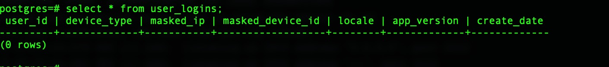
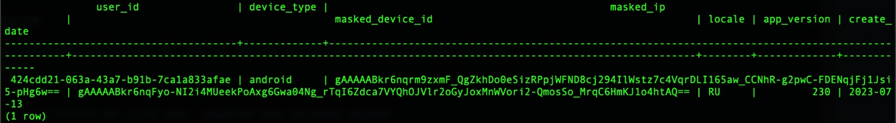

# ETL-off-a-SQS-Queue

### Introduction:

This Exercise focuses on fetching the data from AWS SQS Queue, transforming that data, then writing it to a Postgres database. 

1. Start the postgres server and aws localstack by running the docker compose file.   
`docker compose up`
2. Start the jupyter notebook.  
`jupyter notebook`
3. Install the necessary dependencies.   
`pip3 install boto3`  
`pip3 install psycopg2-binary`

### Testing.
1. Login to the postgres server.  
`psql -d postgres -U postgres -p 5432 -h localhost -W`
`select * from user_logins;`
2. Open the `Fetch.ipynb` file and run each cell. 
3. Open the postgres server and observe that the table is updated with new details. 

### Screenshots:

Inital Database State.

Database State after running the Fetch.ipynb notebook.

### My Approach

● How will you read messages from the queue?
- To read messages from the queue, I would establish a boto3 client, a service from AWS SDK for Python, to interface with the local SQS queue. This client then utilizes the 'receive message' function to retrieve the message.

● What type of data structures should be used?
- I will be utilizing an Object-Oriented Programming (OOP) approach for storing your data. Each instance of the `Message` class represents a unique record or message. This object can then be used directly or converted to a dictionary if required for further operations such as JSON serialization.
- So, in this context, the data structure we are using the custom Python object (an instance of the `Message` class). The class design enables the neat organization of related data and the possibility of adding methods for data manipulation within the class if necessary in the future.

● How will you mask the PII data so that duplicate values can be identified?
- In terms of safeguarding Personally Identifiable Information (PII), cryptographic libraries would be utilized to encrypt these sensitive fields. The identical key would be applied for decryption, ensuring that repeated messages are encrypted in the same way, which simplifies the process of identifying duplicates.

● What will be your strategy for connecting and writing to Postgres?
- As for interfacing with a Postgres database, I would employ psycopg2 - a PostgreSQL database adapter for Python. This acts as a Postgres client, enabling the application to connect to the database and execute operations.

● Where and how will your application run?
- The application can be operated on any computing platform. An effective approach could be to use AWS Lambda, a serverless computing service that runs your code in response to events. For instance, it could be set to trigger upon receipt of a new SQS message, subsequently interacting with the Postgres database to store the data.

### Questions

● How would you deploy this application in production?

1.  Begin by packaging your application code and dependencies into a deployment package. This package would be uploaded to AWS Lambda to create your Lambda function.
2.  I would then configure the function to be triggered upon receiving a new message in your SQS queue.
3.  AWS Lambda would execute this function each time a new message arrives in the queue. In your function, the code would interact with the Postgres database to store the retrieved data.
4.  AWS Lambda scales automatically, running your function as often as needed to keep up with incoming messages to the SQS queue.

● What other components would you want to add to make this production ready?

-   AWS CloudWatch: This service would be essential for monitoring the performance of your application and logging operational data. It provides the ability to set alarms and automated actions based on pre-defined thresholds or patterns. For example, an alarm could be triggered if the number of messages in the queue exceeds a certain limit for a specified duration.

-   Dead Letter Queue (DLQ): This is a useful component for handling message processing failures. Messages that cannot be processed are sent to the DLQ, providing the opportunity to analyze the cause of failure and retry processing these messages later.

● How can this application scale with a growing dataset.

-   AWS Lambda, by design, is built to scale automatically, running your code in response to each trigger. As the volume of data in your SQS queue grows, Lambda functions will be invoked more frequently to process incoming messages, thus handling the increasing load.
    
-   For the Postgres database, we can consider employing AWS RDS (Relational Database Service) with its ability to scale compute resources and storage capacity as your dataset grows.

● How can PII be recovered later on? 

- Since we're using symmetric encryption (Fernet) to mask PII data, the original data can be recovered by using the same key to decrypt the encrypted fields. It is important to securely manage the key to ensure the ability to recover PII data when necessary.

● What are the assumptions you made?

- Data format will be consistent. There will be no missing fields or null values. 
- No new columns will be added. If new columns are added null values
- Current implentation is not persistent in storage wise. when ever docker server is restarted it will remove the data.  To mitigate this we can create a Docker volume for handling persistent data which can be created by and used by Docker containers.
